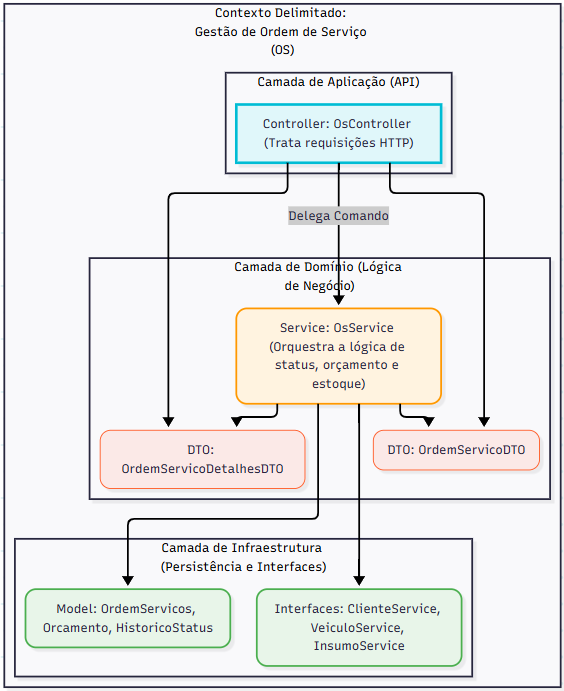

# Documentação DDD - Contexto: Gestão de Ordem de Serviço (OS)

Este documento detalha o contexto delimitado (Bounded Context) responsável pelo ciclo de vida completo da Ordem de Serviço (OS), desde sua criação até a entrega final ao cliente.

## 1. Linguagem Ubíqua (Ubiquitous Language)

A Linguagem Ubíqua define os termos essenciais para o fluxo de OS, garantindo clareza e consistência entre todos os membros da equipe.

| Termo DDD | Significado no Projeto "MotorTech" | Contexto/Regras de Negócio | 
 | ----- | ----- | ----- | 
| **Ordem de Serviço (OS)** | O Aggregate Root central; representa o ciclo de manutenção do veículo. | Possui `cliente_id`, `veiculo_id`, `valor_total` e `status`. | 
| **Status da OS** | O estado atual da OS em seu ciclo de vida. | Estados chave: `RECEBIDA`, `EM_DIAGNOSTICO`, `AGUARDANDO_APROVACAO`, `EM_EXECUCAO`, `FINALIZADA`, `ENTREGUE`. | 
| **Histórico de Status** | O log imutável de todas as transições de status da OS. | Essencial para rastreabilidade e auditoria. | 
| **Orçamento** | Entidade que detalha os custos de Peças/Serviços e exige aprovação do cliente. | Agregado que se comunica com a OS. Possui `valor_total` e status: `AGUARDANDO_APROVACAO`, `APROVADO`, `REPROVADO`. | 
| **Peça da OS / Insumo da OS** | Itens necessários para o reparo que são retirados do Estoque **após** a aprovação do Orçamento. | Reflete o consumo do contexto Gestão de Estoque (GEI). | 

## 2. Diagrama de Contextos Delimitados (Context Map)

O Context Map mostra as interações e dependências entre os principais domínios do sistema.

| Contexto Delimitado | Tipo de Contexto | Descrição | 
| :--- | :--- | :--- |
| **Gestão de Ordem de Serviço (OS)** | *Core Domain* (Domínio Principal) | Responsável pelo ciclo de vida da OS, Orçamentos e acompanhamento do Cliente. |
| **Gestão de Estoque e Insumos (GEI)** | *Core Domain* (Domínio Principal) | Responsável pelo CRUD de Peças/Insumos e pelo controle de estoque. |
| **Gestão de Clientes e Veículos (GCV)** | *Supporting* (Domínio de Suporte) | Responsável pelo CRUD de informações cadastrais de clientes e seus veículos. |

**Relacionamento entre Contextos:**

* **Gestão de OS (Cliente)** $\rightarrow$ **Gestão de Estoque e Insumos (Fornecedor)**: A Gestão de OS consulta o estoque e exige a baixa de Peças/Insumos após a aprovação do Orçamento.
    * **Padrão:** *Conformista* (Conformist).

* **Gestão de OS (Cliente)** $\rightarrow$ **Gestão de Clientes e Veículos (Fornecedor)**: A OS exige dados de Cliente e Veículo para ser aberta e validada.
    * **Padrão:** *Parceria* (Partnership).

## 3. Event Storming - Criação e Acompanhamento da OS

O Event Storming mapeia o fluxo de trabalho detalhado do ciclo de vida da Ordem de Serviço, com base nas regras do `OsService`.

### Fluxo 1: Criação e Aprovação Interna da OS

| Tipo | Descrição | Envolvidos | 
 | ----- | ----- | ----- | 
| **\[Comando\]** | `AbrirOS` (Cliente ID, Veículo ID, Observações) | Atendente/Sistema Externo | 
| **\[Regra/Política\]** | Cliente e Veículo devem existir (Serviços GCV) |  | 
| **\[Agregado\]** | `OrdemDeServico` | Define status inicial como `RECEBIDA` | 
| **\[Evento\]** | `OSRecebida` (OS ID, Cliente ID) | Histórico, Administrativo | 
| **\[Comando\]** | `AprovarOSParaDiagnostico` (OS ID) | Gestor/Mecânico Chefe | 
| **\[Regra\]** | OS deve estar em status `RECEBIDA` |  | 
| **\[Evento\]** | `OSIniciaDiagnostico` (OS ID) | Mecânico | 

### Fluxo 2: Diagnóstico, Orçamento e Aprovação do Cliente

| Tipo | Descrição | Envolvidos | 
 | ----- | ----- | ----- | 
| **\[Comando\]** | `RegistrarDiagnosticoEGerarOrcamento` (OS ID, Lista de Serviços, Lista de Peças/Quantidades) | Mecânico | 
| **\[Regra\]** | OS deve estar em status `EM_DIAGNOSTICO` |  | 
| **\[Regra/Política\]** | **Verificar Estoque Prévio:** Peças solicitadas devem ter `quantidade_estoque` suficiente (Contexto GEI). | Sistema, GEI | 
| **\[Agregado\]** | `Orçamento` | Calcula `valor_total` (Serviços + Peças) | 
| **\[Evento\]** | `OrcamentoGeradoParaAprovacao` (OS ID, Valor Total, Link de Aprovação) | Cliente, Histórico | 
| **\[Comando\]** | `ClienteAprovaOrcamento` (Orçamento ID) ou `ClienteReprovaOrcamento` | Cliente (API Externa) | 
| **\[Política/Processo\]** | Se **Orçamento Aprovado** |  | 
| **\[Comando\]** | `MoverOSEmExecucaoEBaixarEstoque` (OS ID) | OS Agregado / Sistema | 
| **\[Regra/Política\]** | Baixa a quantidade de Peças do Estoque (Contexto GEI) | GEI Contexto | 
| **\[Evento\]** | `OSIniciaExecucao` (OS ID) | Mecânico, Histórico | 
| **\[Política/Processo\]** | Se **Orçamento Reprovado** |  | 
| **\[Comando\]** | `FinalizarOSComoReprovada` (OS ID) | OS Agregado | 
| **\[Evento\]** | `OSFinalizadaSemExecucao` | Administrativo, Histórico | 

### Fluxo 3: Finalização e Entrega

| Tipo | Descrição | Envolvidos | 
 | ----- | ----- | ----- | 
| **\[Comando\]** | `MecanicoConcluiServico` (OS ID) | Mecânico | 
| **\[Regra\]** | OS deve estar em status `EM_EXECUCAO` |  | 
| **\[Agregado\]** | `OrdemDeServico` | Altera status para `FINALIZADA` | 
| **\[Evento\]** | `ExecucaoDeServicoFinalizada` (OS ID, Valor Total) | Administrativo, Caixa | 
| **\[Comando\]** | `EntregarVeiculoAoCliente` (OS ID) | Atendente/Caixa | 
| **\[Regra\]** | OS deve estar em status `FINALIZADA` |  | 
| **\[Evento\]** | `OSEntregue` (OS ID) | Fechamento de Ciclo | 

## 4. Diagrama de Componentes (Arquitetura)

Este diagrama reflete a estrutura em camadas para o contexto de Ordem de Serviço, mostrando as responsabilidades do `OsController` e `OsService`, que é o orquestrador de lógica de domínio.

)
