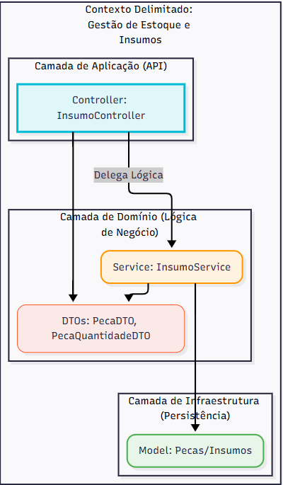

# Documentação DDD - Contexto: Gestão de Estoque e Insumos

Este documento detalha o contexto delimitado (Bounded Context) responsável pela gestão das peças e insumos utilizados na oficina, um pilar fundamental para o fluxo de Ordem de Serviço (OS).

## 1. Linguagem Ubíqua (Ubiquitous Language)

A Linguagem Ubíqua define os termos essenciais que devem ser usados de forma consistente por toda a equipe (desenvolvimento, negócios, QA e stakeholders).

| Termo DDD | Significado no Projeto "MotorTech" | Contexto/Regras de Negócio | 
| ----- | ----- | ----- | 
| **Peça / Insumo** | Qualquer item (físico ou consumível) necessário para a execução de um Serviço na OS (ex: filtro, óleo, pastilha de freio). | Possui `id`, `nome`, `preco_unitario` e `quantidade_estoque`. | 
| **Estoque** | A quantidade total de uma Peça/Insumo disponível na oficina. | Deve ser atualizado por meio de Ações (Adicionar/Remover) e não pode ser negativo (zera em caso de remoção excessiva). | 
| **Movimentação de Estoque** | O evento de entrada ou saída de itens do estoque, registrando a `Ação` (`adicionar` ou `remover`) e a `Quantidade`. | É o único mecanismo para alterar a `quantidade_estoque` de uma Peça. | 
| **Preço Unitário** | O valor de compra ou custo base de uma única unidade da Peça/Insumo. | Usado como base para o cálculo do Orçamento na Ordem de Serviço. | 
| **Ordem de Serviço (OS)** | O processo principal da oficina que consome Peças/Insumos para realizar um Serviço. | É um contexto delimitado **Cliente** deste contexto de Gestão de Estoque. | 

## 2. Diagrama de Contextos Delimitados (Context Map)

O Context Map mostra as interações e dependências entre os principais domínios do sistema.

| Contexto Delimitado | Tipo de Contexto | Descrição | 
| ----- | ----- | ----- | 
| **Gestão de Estoque e Insumos (GEI)** | *Core Domain* (Domínio Principal) | Responsável pelo CRUD de Peças/Insumos e pelo controle de `quantidade_estoque`. (Onde o código fornecido reside). | 
| **Gestão de Ordem de Serviço (OS)** | *Core Domain* (Domínio Principal) | Responsável pelo ciclo de vida da OS, Orçamentos e acompanhamento do Cliente. | 
| **Gestão de Clientes e Veículos (GCV)** | *Supporting* (Domínio de Suporte) | Responsável pelo CRUD de informações cadastrais de clientes e seus veículos. | 

**Relacionamento entre Contextos:**

* **Gestão de OS (Cliente)** $\rightarrow$ **Gestão de Estoque e Insumos (Fornecedor)**: A Gestão de OS precisa consultar o preço de uma Peça/Insumo e, após a aprovação do orçamento, precisa dar baixa (remover) a Peça/Insumo do Estoque.

  * **Padrão:** *Conformista* (Conformist): O contexto OS se adapta ao modelo de Peça do contexto GEI.

## 3. Event Storming - Fluxo de Gestão de Peças e Insumos

O Event Storming mapeia o fluxo de trabalho com foco nos eventos de domínio.

### Fluxo 1: Criação e Edição de Peça/Insumo (CRUD)

| Tipo | Descrição | Envolvidos | 
| ----- | ----- | ----- | 
| **\[Comando\]** | `CadastrarNovaPeca` (Nome, Preço Unitário, Qtd Inicial) | Administrativo, Compras | 
| **\[Agregado\]** | `Peça` |  | 
| **\[Evento\]** | `PecaCadastrada` (Peça ID, Nome, Preço Unitário) | Sistemas de Estoque e OS | 
| **\[Comando\]** | `AtualizarDadosDaPeca` (Peça ID, Novo Nome, Novo Preço) | Administrativo | 
| **\[Agregado\]** | `Peça` |  | 
| **\[Evento\]** | `DadosDaPecaAtualizados` (Peça ID) | Sistemas de Estoque e OS | 

### Fluxo 2: Gestão de Estoque (Movimentação)

| Tipo | Descrição | Envolvidos | 
| ----- | ----- | ----- | 
| **\[Comando\]** | `RegistrarEntradaDeEstoque` (Peça ID, Quantidade Adicionada) | Almoxarifado, Recebimento | 
| **\[Agregado\]** | `Peça` | (Valida ID, calcula novo total) | 
| **\[Evento\]** | `QuantidadeEmEstoqueAlterada` (Peça ID, Quantidade Nova, Movimentação: Entrada) | Contabilidade, Alerta de Estoque (Policy) | 
| **\[Comando\]** | `RegistrarSaidaManualDeEstoque` (Peça ID, Quantidade Removida) | Almoxarifado, Mecânico | 
| **\[Regra\]** | O Estoque não pode ser negativo. Se a remoção for maior que o estoque, o saldo zera. |  | 
| **\[Agregado\]** | `Peça` | (Valida estoque suficiente/calcula novo total) | 
| **\[Evento\]** | `QuantidadeEmEstoqueAlterada` (Peça ID, Quantidade Nova, Movimentação: Saída) | Contabilidade, Gestão OS (se for baixa por consumo) | 
| **\[Política/Processo\]** | Se Estoque Novo < Limite Mínimo |  | 
| **\[Comando\]** | `GerarAlertaDeEstoqueBaixo` (Peça ID, Estoque Atual) | Administrativo, Compras | 

## 4. Diagrama de Componentes (Arquitetura)

Este diagrama reflete a estrutura de Arquitetura em Camadas (Monolito) e como o código fornecido se encaixa nela.

)
