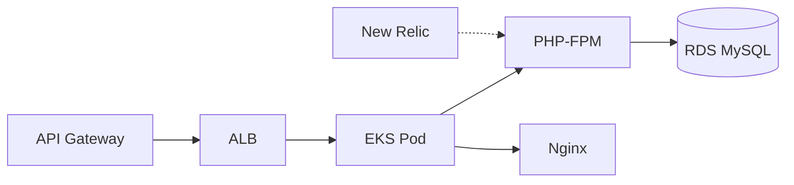

# MotorTech App — API REST Laravel

> Aplicacao principal do sistema MotorTech — API REST para gestao de oficina mecanica, executando em AWS EKS.

## Arquitetura



## Tecnologias

- **PHP 8.2** + **Laravel 12**
- **MySQL 8** (AWS RDS)
- **JWT Auth** (tymon/jwt-auth)
- **Docker** (containerizacao)
- **Kubernetes** (AWS EKS)
- **PHPUnit** (testes)
- **New Relic** (APM)

## Endpoints Principais

| Entidade | Metodo | Rota | Descricao |
|----------|--------|------|-----------|
| Auth CPF | POST | /api/auth/cpf | Autenticacao via CPF (Lambda) |
| Auth | POST | /api/login | Login por email/senha (JWT) |
| Cliente | CRUD | /api/cliente/* | Gestao de clientes |
| Veiculo | CRUD | /api/veiculo/* | Gestao de veiculos |
| Servico | CRUD | /api/servico/* | Gestao de servicos |
| Insumo | CRUD | /api/insumo/* | Gestao de pecas + estoque |
| OS | Fluxo | /api/os/* | Ordens de servico |
| Webhook | POST | /api/webhooks/* | Aprovacao de orcamento |

## Execucao Local

```bash
docker compose up -d --build
# Acessar: http://localhost:8080/api_motortech/public
```

## Testes

```bash
docker exec -it api_motortech php artisan test
```

## CI/CD (GitHub Actions)

| Workflow | Trigger | Acao |
|----------|---------|------|
| ci.yml | PR para main | Testes + Code Style |
| deploy-hml.yml | Push em homologation | Build → ECR → Deploy EKS (HML) |
| deploy-prod.yml | Push em production | Build → ECR → Deploy EKS (PROD) |
