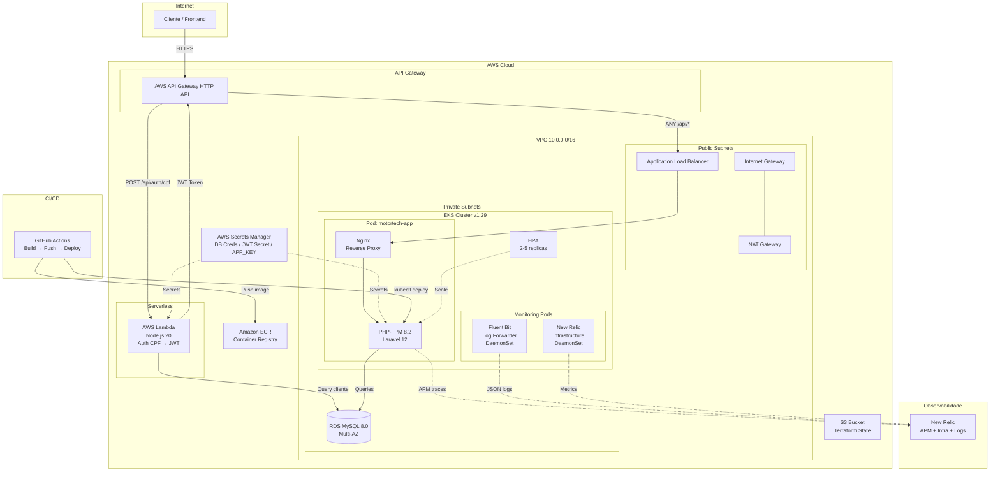

# Diagrama de Componentes — MotorTech (AWS)

## Visão Geral da Arquitetura Cloud

## Componentes e Responsabilidades

| Componente | Serviço AWS | Responsabilidade |
|------------|-------------|-----------------|
| API Gateway | API Gateway HTTP API | Ponto de entrada público, roteamento, rate limiting, CORS |
| Lambda Auth | Lambda (Node.js 20) | Validação de CPF, consulta cliente no RDS, geração de JWT |
| Load Balancer | ALB (via AWS LB Controller) | Distribuição de tráfego para pods EKS |
| App Server | EKS (PHP-FPM + Nginx) | API REST Laravel, lógica de negócio, validações |
| Banco de Dados | RDS MySQL 8.0 | Persistência de dados, Multi-AZ (produção) |
| Container Registry | ECR | Armazenamento de imagens Docker da aplicação |
| Secrets | Secrets Manager | Credenciais DB, JWT_SECRET, APP_KEY, webhook token |
| Terraform State | S3 + DynamoDB | Estado remoto do Terraform com locking |
| APM | New Relic PHP Agent | Monitoramento de transações, queries, erros |
| Infra Monitoring | New Relic Infrastructure | CPU, memória, disco por node/pod |
| Logs | Fluent Bit → New Relic Logs | Agregação de logs JSON estruturados |
| CI/CD | GitHub Actions | Build, test, push ECR, deploy EKS automático |

## Fluxo de Rede

1. **Requisições externas** entram pelo API Gateway (público)
2. **Autenticação CPF** é roteada para a Lambda (serverless, dentro da VPC)
3. **Requisições autenticadas** passam pelo ALB (subnet pública) para os pods EKS (subnet privada)
4. **Pods EKS** acessam o RDS (subnet privada) via security groups
5. **Lambda** acessa o RDS (subnet privada) via ENI na VPC
6. **Saída internet** dos pods privados passa pelo NAT Gateway

## Segurança

- **API Gateway**: CORS configurado, rate limiting
- **Lambda**: IAM Role com permissões mínimas, VPC-attached
- **EKS**: Nodes em subnets privadas, IRSA para service accounts
- **RDS**: Subnet privada, SG permite apenas EKS e Lambda na porta 3306
- **Secrets Manager**: Rotação automática de credenciais
- **ALB**: Interno (não exposto diretamente à internet)
- **JWT**: HS256 com secret compartilhado via Secrets Manager
