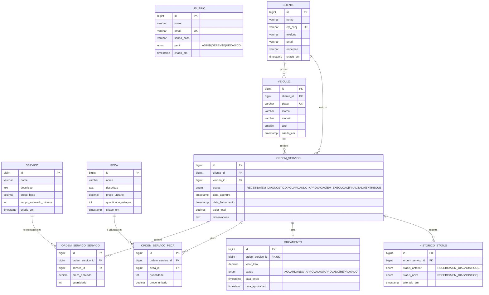

# Diagrama Entidade-Relacionamento — MotorTech

## Diagrama ER

## Justificativa da Escolha do Banco de Dados

### Por que MySQL 8.0?

1. **Compatibilidade**: O projeto já utiliza MySQL desde a Fase 1, mantendo consistência e evitando custos de migração de dados
2. **Suporte AWS**: Amazon RDS oferece MySQL gerenciado com backup automático, Multi-AZ, Performance Insights e patches automáticos
3. **ACID Compliance**: InnoDB (engine padrão) garante transações ACID, essencial para o fluxo de OS que envolve múltiplas tabelas
4. **ENUMs nativos**: MySQL suporta ENUM nativamente, usado extensivamente para status de OS e orçamento
5. **Performance**: Índices criados em tabelas de associação (idx_os_servico, idx_os_peca, idx_historico_os) garantem consultas eficientes
6. **Custo**: RDS MySQL t3.micro qualifica para Free Tier, reduzindo custos do projeto acadêmico

### Alternativas Consideradas

| Banco | Prós | Contras | Decisão |
|-------|------|---------|---------|
| PostgreSQL | Mais funcionalidades, JSONB | Migração necessária, sem experiência prévia no time | Descartado |
| Aurora MySQL | Compatível, alta performance | Custo mais alto (~3x RDS MySQL) | Descartado por custo |
| DynamoDB | Serverless, escala automática | Modelo relacional não adequado, reescrita total | Descartado |

## Relacionamentos Detalhados

### 1. Cliente → Veículo (1:N)
Um cliente pode possuir múltiplos veículos. Cada veículo pertence a exatamente um cliente. A remoção de um cliente causa cascata nos veículos (`ON DELETE CASCADE`).

### 2. Cliente → Ordem de Serviço (1:N)
Um cliente pode ter várias ordens de serviço abertas ao longo do tempo. Cada OS está vinculada a um único cliente.

### 3. Veículo → Ordem de Serviço (1:N)
Um veículo pode ter várias OS (manutenções diferentes). Cada OS refere-se a um único veículo.

### 4. Ordem de Serviço → Serviços (N:M via ordem_servico_servico)
Uma OS pode incluir múltiplos serviços (ex: troca de óleo + alinhamento). Um serviço pode estar em várias OS. A tabela intermediária registra o preço aplicado e quantidade, permitindo variações de preço.

### 5. Ordem de Serviço → Peças (N:M via ordem_servico_peca)
Uma OS pode utilizar várias peças. Uma peça pode ser utilizada em várias OS. A tabela intermediária registra quantidade e preço unitário no momento do uso.

### 6. Ordem de Serviço → Orçamento (1:1)
Cada OS gera no máximo um orçamento. O orçamento é criado durante o diagnóstico e pode ser aprovado ou reprovado.

### 7. Ordem de Serviço → Histórico de Status (1:N)
Cada transição de status da OS gera um registro no histórico, permitindo rastreabilidade completa (auditoria).

### 8. Usuario (isolado)
A tabela `usuario` armazena os operadores do sistema (admin, gerente, mecânico). Não possui FK direta com as demais tabelas de domínio — a relação é lógica (quem opera o sistema).

## Índices de Performance

| Tabela | Índice | Colunas | Propósito |
|--------|--------|---------|-----------|
| ordem_servico_servico | idx_os_servico | ordem_servico_id | Busca rápida de serviços por OS |
| ordem_servico_peca | idx_os_peca | ordem_servico_id | Busca rápida de peças por OS |
| historico_status | idx_historico_os | ordem_servico_id | Consulta histórico por OS |
| cliente | UNIQUE | cpf_cnpj | Busca por CPF/CNPJ e prevenção de duplicatas |
| veiculo | UNIQUE | placa | Busca por placa e prevenção de duplicatas |
| orcamento | UNIQUE | ordem_servico_id | Garante 1:1 com ordem_servico |
