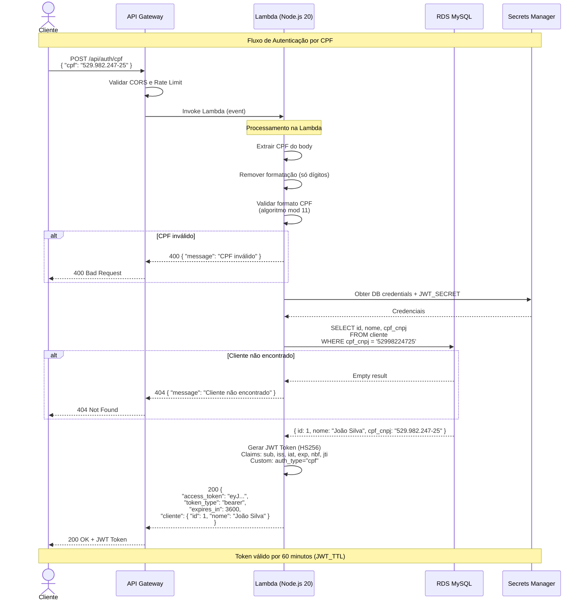

# Diagrama de Sequência — Autenticação via CPF

## Fluxo Completo

## Detalhes Técnicos

### Claims do JWT gerado pela Lambda

| Claim | Descrição | Exemplo |
|-------|-----------|---------|
| `iss` | Emissor do token | `motortech-lambda` |
| `sub` | ID do cliente | `"1"` |
| `iat` | Timestamp de emissão | `1711234567` |
| `exp` | Timestamp de expiração | `1711238167` (iat + 3600s) |
| `nbf` | Válido a partir de | `1711234567` (= iat) |
| `jti` | ID único do token | `"a1b2c3d4-..."` (UUID v4) |
| `auth_type` | Tipo de autenticação | `"cpf"` |
| `cliente_nome` | Nome do cliente | `"João Silva"` |

### Validação do CPF (Algoritmo)

1. Remove caracteres não numéricos
2. Verifica se tem exatamente 11 dígitos
3. Rejeita CPFs com todos os dígitos iguais (ex: 111.111.111-11)
4. Calcula primeiro dígito verificador (módulo 11, pesos 10→2)
5. Calcula segundo dígito verificador (módulo 11, pesos 11→2)
6. Compara os dígitos calculados com os informados

### Compatibilidade com Laravel (tymon/jwt-auth)

O token gerado pela Lambda é validado pelo middleware `auth:api-cliente` do Laravel. A compatibilidade é garantida por:

- **Algoritmo**: HS256 (mesmo configurado em `config/jwt.php`)
- **Secret**: Mesmo `JWT_SECRET` compartilhado via Secrets Manager
- **Claims obrigatórios**: `iss`, `iat`, `exp`, `nbf`, `sub`, `jti` (conforme `required_claims` do jwt.php)
- **Guard**: `api-cliente` com provider `clientes` (model `App\Models\Cliente`)
