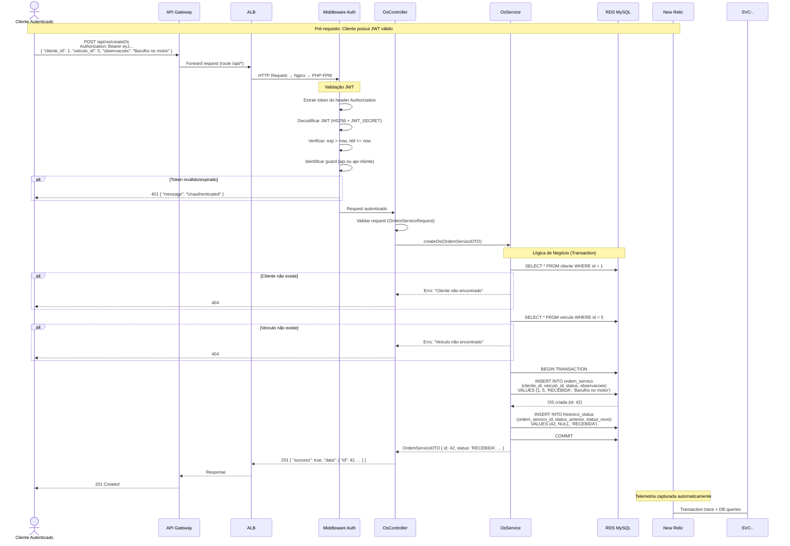
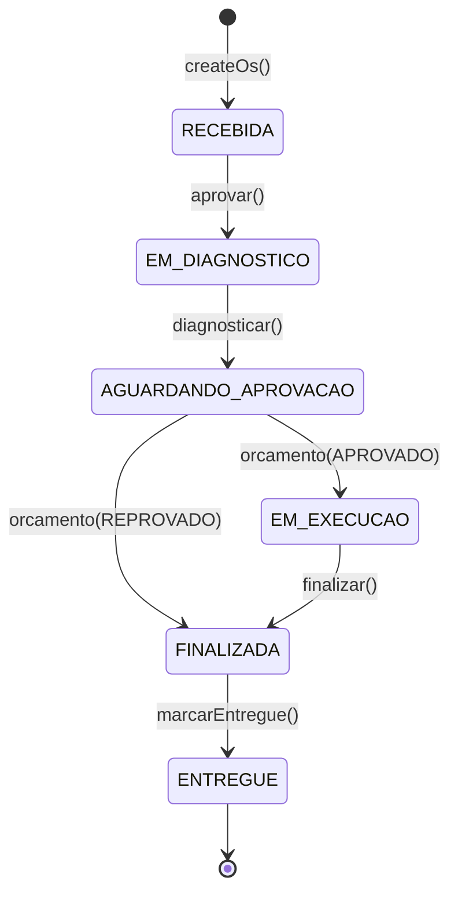

# Diagrama de Sequência — Abertura de Ordem de Serviço

## Fluxo Completo

## Máquina de Estados da Ordem de Serviço

## Endpoints do Fluxo de OS

| Etapa | Método | Rota | Status Anterior | Status Novo |
|-------|--------|------|-----------------|-------------|
| Criar OS | POST | `/api/os/createOs` | — | RECEBIDA |
| Aprovar para diagnóstico | PUT | `/api/os/aprovar/{id}` | RECEBIDA | EM_DIAGNOSTICO |
| Diagnosticar | POST | `/api/os/diagnosticar/{id}` | EM_DIAGNOSTICO | AGUARDANDO_APROVACAO |
| Aprovar orçamento | PUT | `/api/os/orcamento/{id}/APROVADO` | AGUARDANDO_APROVACAO | EM_EXECUCAO |
| Reprovar orçamento | PUT | `/api/os/orcamento/{id}/REPROVADO` | AGUARDANDO_APROVACAO | FINALIZADA |
| Finalizar | PUT | `/api/os/finalizar/{id}` | EM_EXECUCAO | FINALIZADA |
| Confirmar entrega | GET | `/public/os/{id}/confirm-entrega` | FINALIZADA | ENTREGUE |

## Tabelas Envolvidas

Cada transição de status gera um registro em `historico_status`, garantindo rastreabilidade completa do ciclo de vida da OS.
